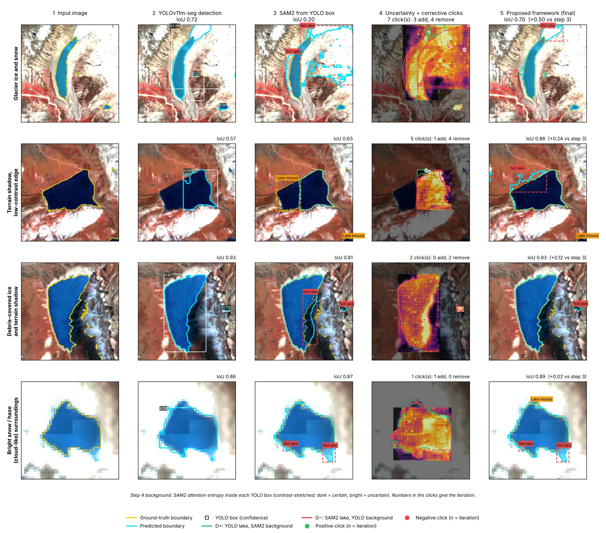

# Response to Reviewer 7hF5

**ICVGIP 2026 — Submission 485**
*Glacial Lake Segmentation using YOLOv11m-seg and SAM2 with Uncertainty-Guided Refinement*

[← Back to main README](../../README.md) · Other reviewers: [ry7S](../ry7S/README.md) · [FjD2](../FjD2/README.md)

We thank the reviewer for raising these concerns. This page is a self-contained response: tables and figures are numbered locally and match the numbers in our rebuttal text. It collects every table and figure cited in our response to Reviewer 7hF5.

| Points | Topic | Evidence on this page |
|---|---|---|
| R1, R3, R4 | Distinction and novelty | Fig. 1, Table 1 |
| R2 | YOLO variants | Table 2 |
| R5 | Alternative data split | Table 3 |
| R6 | Generalisation | Table 4 |

---

## R1, R3 & R4 — Distinction and novelty

YOLO11, SAM2 and uncertainty estimation are individually established. Our contribution is **how they interact in an automatic correction loop**:

1. **YOLOv11m-seg** provides localisation (boxes) and a rough lake mask.
2. **YOLO–SAM2 disagreement** identifies candidate error regions:
   - D+ = YOLO says lake, SAM2 says background → candidate for a **positive** click
   - D− = SAM2 says lake, YOLO says background → candidate for a **negative** click
3. **SAM2 attention entropy** ranks these regions by uncertainty.
4. **Positive/negative corrective prompts** are fed back to SAM2, and the mask is updated iteratively until consecutive masks agree (IoU ≥ 0.95).

No user clicks and no additional trainable correction parameters are needed. We claim this **uncertainty-weighted, disagreement-driven iterative correction policy** as the methodological contribution — not a new backbone.

### Fig. 1: Step-by-step correction under challenging conditions

Columns: (1) input, (2) YOLOv11m-seg detection, (3) SAM2 from the YOLO box, (4) attention-entropy uncertainty map with corrective clicks, (5) final output of the proposed framework.

### Table 1: Comparison with related prompt-refinement approaches

| Approach | Needs training | Needs user clicks | Iterative correction | Uses model uncertainty |
|---|---|---|---|---|
| RITM, SimpleClick (interactive segmentation) | Yes | Yes | Yes | No |
| FocSAM | Yes | Yes | Yes | No |
| VRP-SAM | Yes | No | No | No |
| Adaptive SAM | Yes | No | No | No |
| RS-SAM (remote-sensing SAM adaptation) | Yes | No | No | No |
| Detector-to-SAM pipeline (YOLO + SAM2) | No | No | No | No |
| **Proposed framework** | **No** | **No** | **Yes** | **Yes** |

---

## R2 — YOLO variants

### Table 2: Performance of YOLOv11 variants and component-wise ablation

| # | Model / Configuration | IoU | Dice/F1 | Prec. | Recall | Spec. | Pix. Acc. | Bal. Acc. | Params |
|---|---|---|---|---|---|---|---|---|---|
| 1 | YOLOv11n-seg | **0.7511** | 0.8579 | 0.8950 | 0.8237 | 0.9877 | 0.9737 | 0.9067 | 2.9M |
| 2 | YOLOv11s-seg | 0.7117 | 0.8315 | 0.8172 | 0.7605 | 0.8927 | 0.9703 | 0.8766 | 10.1M |
| 3 | YOLOv11m-seg | 0.7021 | 0.8250 | 0.8368 | 0.7370 | 0.9947 | 0.9698 | 0.8659 | 22.4M |
| 4 | YOLOv11l-seg | 0.7221 | 0.8386 | 0.8776 | 0.7794 | 0.9415 | 0.9711 | 0.8855 | 27.6M |
| 5 | YOLOv11x-seg | 0.6978 | 0.8220 | 0.8627 | 0.7477 | 0.8424 | 0.9687 | 0.8700 | 62.1M |
| 6 | YOLOv11m-seg + SAM2 (direct) | 0.7600 | 0.8150 | 0.7520 | 0.8154 | 0.9868 | 0.9804 | 0.8991 | 103.2M |
| 7 | + Boundary-aware box | 0.6459 | 0.7849 | 0.7764 | 0.7936 | 0.9651 | 0.9423 | 0.8793 | 103.2M |
| 8 | + Boundary-aware box and points | 0.6804 | 0.8098 | 0.8024 | 0.8174 | 0.9692 | 0.9491 | 0.8933 | 103.2M |
| 9 | + Random clicks (same number) | 0.7092 | 0.8299 | 0.8499 | 0.8108 | 0.9781 | 0.9559 | 0.8944 | 103.2M |
| 10 | + Distance-based clicks (same number) | 0.7049 | 0.8269 | 0.8436 | 0.8109 | 0.9770 | 0.9550 | 0.8940 | 103.2M |
| **11** | **+ Uncertainty-guided correction (proposed)** | **0.7876** | **0.8222** | **0.7636** | **0.8126** | **0.9867** | **0.9802** | **0.8997** | **103.2M** |
| 12 | Full framework (box, points and correction) | 0.7876 | 0.8222 | 0.7636 | 0.8126 | 0.9867 | 0.9802 | 0.8997 | 103.2M |

- All five variants (n/s/m/l/x) were evaluated standalone (rows 1–5). **Nano is the best standalone variant** in this experiment.
- **Only YOLOv11m was run through the complete refinement pipeline**, so we do not claim medium is universally the best refined variant.
- For YOLOv11m: direct YOLO–SAM2 0.7600 IoU → full method 0.7876 IoU (rows 6 → 11).

---

## R5 — Alternative data split

### Table 3: Primary vs alternative data-split strategy

| Data-split strategy | Training | Validation | Test | IoU | Dice/F1 | Precision | Recall |
|---|---|---|---|---|---|---|---|
| Primary split (used in study) | 333 (13.7%) | 464 (19.0%) | 1640 (67.3%) | 0.7876 | 0.8222 | 0.7636 | 0.8126 |
| Alternative split (70:15:15) | 1706 (70.0%) | 366 (15.0%) | 365 (15.0%) | 0.7209 | 0.8378 | 0.8660 | 0.8114 |

The two test populations differ, so we present this as evidence under another split, **not** as proof that one split is better.

---

## R6 — Generalisation

### Table 4: Dataset distribution

| Dataset | Source | Images | Ground truth |
|---|---|---|---|
| Training | Roboflow glacial-lake datasets (training split) | 333 | 333 |
| Validation | Roboflow glacial-lake datasets (validation split) | 464 | 464 |
| Test | Kaggle Glacial Lake Dataset (Sentinel-2, 10 m, Himalaya) | 1640 | 1640 |
| **Total** | All datasets combined | **2437** | **2437** |

Training and validation use Roboflow sources; the main test set is a **separate Kaggle Sentinel-2 Himalayan source**. This gives cross-source evidence within glacial-lake imagery. It does **not** prove cross-sensor, geographic, temporal or cross-task generalisation, and we limit our conclusion accordingly.

---
