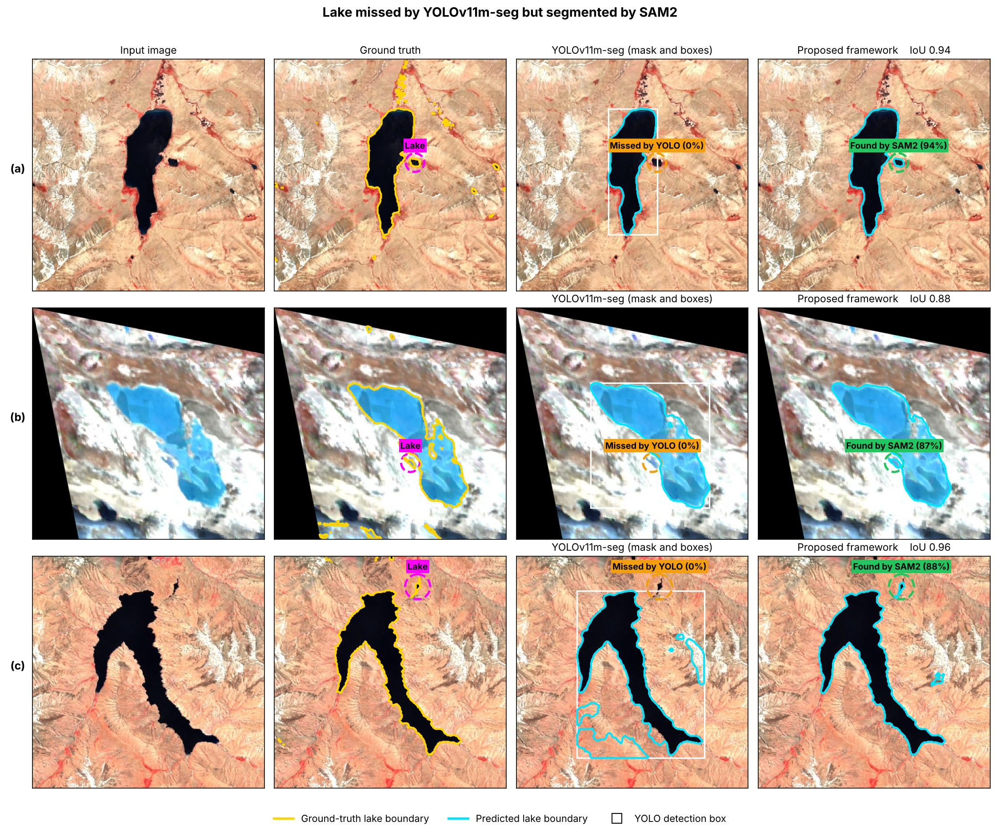

# Response to Reviewer FjD2

**ICVGIP 2026 — Submission 485**
*Glacial Lake Segmentation using YOLOv11m-seg and SAM2 with Uncertainty-Guided Refinement*

[← Back to main README](../../README.md) · Other reviewers: [ry7S](../ry7S/README.md) · [7hF5](../7hF5/README.md)

We thank the reviewer for the detailed review. This page is a self-contained response: tables and figures are numbered locally and match the numbers in our rebuttal text. It collects every table and figure cited in our response to Reviewer FjD2.

| Points | Topic | Evidence on this page |
|---|---|---|
| R1–R3 | Improvement and ablation | Table 1 |
| R4–R6 | Dataset and comparison | Table 2, Table 3 |
| R7–R13 | Reproducibility | Implementation settings |
| R14–R18 | Iterations, uncertainty and computation | Table 4, Table 5, Table 6 |
| R19–R22 | Limitations and novelty | Table 7, Table 8, Fig. 1, Fig. 2 |

---

## R1–R3 — Improvement and component-wise ablation

### Table 1: Performance of YOLOv11 variants and component-wise ablation

| # | Model / Configuration | IoU | Dice/F1 | Prec. | Recall | Spec. | Pix. Acc. | Bal. Acc. | Params |
|---|---|---|---|---|---|---|---|---|---|
| 1 | YOLOv11n-seg | 0.7511 | 0.8579 | 0.8950 | 0.8237 | 0.9877 | 0.9737 | 0.9067 | 2.9M |
| 2 | YOLOv11s-seg | 0.7117 | 0.8315 | 0.8172 | 0.7605 | 0.8927 | 0.9703 | 0.8766 | 10.1M |
| 3 | YOLOv11m-seg | 0.7021 | 0.8250 | 0.8368 | 0.7370 | 0.9947 | 0.9698 | 0.8659 | 22.4M |
| 4 | YOLOv11l-seg | 0.7221 | 0.8386 | 0.8776 | 0.7794 | 0.9415 | 0.9711 | 0.8855 | 27.6M |
| 5 | YOLOv11x-seg | 0.6978 | 0.8220 | 0.8627 | 0.7477 | 0.8424 | 0.9687 | 0.8700 | 62.1M |
| 6 | YOLOv11m-seg + SAM2 (direct) | 0.7600 | 0.8150 | 0.7520 | 0.8154 | 0.9868 | 0.9804 | 0.8991 | 103.2M |
| 7 | + Boundary-aware box | 0.6459 | 0.7849 | 0.7764 | 0.7936 | 0.9651 | 0.9423 | 0.8793 | 103.2M |
| 8 | + Boundary-aware box and points | 0.6804 | 0.8098 | 0.8024 | 0.8174 | 0.9692 | 0.9491 | 0.8933 | 103.2M |
| 9 | + Random clicks (same number) | 0.7092 | 0.8299 | 0.8499 | 0.8108 | 0.9781 | 0.9559 | 0.8944 | 103.2M |
| 10 | + Distance-based clicks (same number) | 0.7049 | 0.8269 | 0.8436 | 0.8109 | 0.9770 | 0.9550 | 0.8940 | 103.2M |
| **11** | **+ Uncertainty-guided correction (proposed)** | **0.7876** | **0.8222** | **0.7636** | **0.8126** | **0.9867** | **0.9802** | **0.8997** | **103.2M** |
| 12 | Full framework (box, points and correction) | 0.7876 | 0.8222 | 0.7636 | 0.8126 | 0.9867 | 0.9802 | 0.8997 | 103.2M |

**Reading the ablation**

- Direct YOLOv11m-seg + SAM2 (row 6) → full method (row 11): IoU 0.7600 → 0.7876 (**+2.76 points**).
- Same click budget, different click selection: random 0.7092 (row 9), distance-based 0.7049 (row 10), uncertainty-ranked 0.7876 (row 11).
- Geometric prompting alone (boundary-aware box, rows 7–8) is not consistently beneficial.
- Our evidence therefore supports the **complete** disagreement-selection + uncertainty-ranking correction policy. We do not claim that entropy alone causes the full improvement.

---

## R4–R6 — Dataset and comparison

### Table 2: Dataset distribution

| Dataset | Source | Images | Ground truth |
|---|---|---|---|
| Training | Roboflow glacial-lake datasets (training split) | 333 | 333 |
| Validation | Roboflow glacial-lake datasets (validation split) | 464 | 464 |
| Test | Kaggle Glacial Lake Dataset (Sentinel-2, 10 m, Himalaya) | 1640 | 1640 |
| **Total** | All datasets combined | **2437** | **2437** |

There is no overlap between the training, validation and test sets; the test set comes from a separate source.

### Table 3: Comparison with other methods

**(a) Trained on the same data and tested on the same test set**

| Test set | Method | IoU | Dice/F1 | Precision | Recall |
|---|---|---|---|---|---|
| Kaggle (Sentinel-2) | U-Net | 0.5145 | 0.6795 | 0.6058 | 0.7735 |
| Kaggle (Sentinel-2) | DeepLabV3+ | 0.6403 | 0.7807 | 0.8706 | 0.7077 |
| Kaggle (Sentinel-2) | YOLOv11m-seg + SAM2 | 0.7600 | 0.8150 | 0.7520 | 0.8154 |
| **Kaggle (Sentinel-2)** | **Proposed framework** | **0.7876** | **0.8222** | **0.7636** | **0.8126** |

**(b) Reported in other papers on their own datasets — literature context only, not directly comparable**

| Data | Method | IoU | Dice/F1 | Precision | Recall |
|---|---|---|---|---|---|
| Sentinel-1 & Sentinel-2 | U-ViT | 0.808 | 0.894 | 0.902 | 0.887 |
| Sentinel-1 & Sentinel-2 | U-Net | 0.655 | 0.792 | 0.814 | 0.771 |
| Sentinel-1 & Sentinel-2 | DeepLabV3+ | 0.662 | 0.797 | 0.820 | 0.775 |
| Sentinel-2 | YOLOv5-seg | 0.7160 | 0.7900 | 0.8245 | 0.7600 |
| Sentinel-2 | Adaptive SAM | 0.7600 | 0.8073 | 0.8200 | 0.8113 |

---

## R7–R13 — Reproducibility

### Implementation settings

| Component | Setting |
|---|---|
| Detector | YOLOv11m-seg, single class `lake` |
| Detector training | 120 epochs, image size 640, batch size 4, AdamW optimiser |
| Detector inference | image size 640, confidence threshold 0.25, NMS IoU 0.45, max 100 detections |
| Segmenter | SAM2 Hiera-B+ (checkpoint `sam2_hiera_base_plus.pt`, config `sam2_hiera_b+.yaml`), frozen, no fine-tuning |
| Initial box prompt | One box per YOLO detection |
| Initial positive / negative points | Boundary-aware variant: box expanded by 6%, one positive point at the YOLO-mask centroid, up to 4 negative points just outside the mask extent (6% margin; left, right, top, bottom) |
| Candidate error regions | D+ = YOLO lake ∧ SAM2 background (→ positive click); D− = SAM2 lake ∧ YOLO background (→ negative click) |
| Ranking of regions | SAM2 attention entropy inside each YOLO box |
| Clicks per iteration | One click, at the point of highest attention entropy in the disagreement regions; regions smaller than 16 px or 0.2% of the box are ignored |
| Stopping rule | IoU ≥ 0.95 between consecutive masks (stability only), max 5 iterations |
| Morphology | 3×3 opening on disagreement regions; 3×3 opening and closing on the final mask |
| Evaluation | IoU, Dice/F1, Precision, Recall, Specificity, Pixel and Balanced Accuracy on the Kaggle Sentinel-2 test set |
| Hardware | NVIDIA T4 GPU |

---

## R14–R18 — Iterations, uncertainty and computation

### Table 4: Performance after each iteration

| Iteration | IoU | Dice/F1 | Precision | Recall |
|---|---|---|---|---|
| Initial SAM2 | 0.7157 | 0.8343 | 0.8583 | 0.8116 |
| 1 | 0.7142 | 0.8333 | 0.8572 | 0.8107 |
| 2 | 0.7180 | 0.8359 | 0.8629 | 0.8104 |
| 3 | 0.7184 | 0.8361 | 0.8623 | 0.8115 |
| **4** | **0.7876** | **0.8222** | **0.7636** | **0.8126** |
| 5 | 0.7876 | 0.8222 | 0.7636 | 0.8126 |

IoU ≥ 0.95 between consecutive masks is used **only as a stability stopping condition**, not as a measure of correctness.

### Table 5: Validation of the uncertainty map against SAM2 error pixels

| Uncertainty map | AUROC |
|---|---|
| **Attention entropy (proposed)** | **0.728** |
| Distance to boundary | 0.693 |
| Predictive entropy | 0.559 |

### Table 6: Computational cost on an NVIDIA T4 GPU

| Component | Value |
|---|---|
| YOLOv11m-seg | 59.3 ms (123.3 GFLOPs) |
| SAM2 image encoder (once per image) | 309.6 ms (646.8 GFLOPs) |
| SAM2 mask decoder (per iteration) | 19.7 ms (3.66 GFLOPs) |
| Average corrective clicks per image | 0.91 |
| YOLOv11m-seg + SAM2 (total) | 408.9 ms per image |
| **Proposed framework (total)** | **420.8 ms per image (2.38 images/s), 774.6 GFLOPs** |
| Peak GPU memory | 1.37 GB |
| Parameters | 103.2M (no additional parameters) |

The correction loop adds about **12 ms per image** (+2.9%) over direct YOLOv11m-seg + SAM2, because the SAM2 image encoder runs once and only the light mask decoder is repeated.

---

## R19–R22 — Limitations and novelty

### Table 7: IoU and Dice under challenging conditions

| Condition | Images | IoU (YOLOv11m-seg + SAM2) | Dice (YOLOv11m-seg + SAM2) | IoU (Proposed) | Dice (Proposed) |
|---|---|---|---|---|---|
| Small lakes | 137 | 0.5774 | 0.7321 | **0.7024** | **0.8283** |
| Medium lakes | 136 | 0.7263 | 0.8415 | **0.7618** | **0.8686** |
| Large lakes | 137 | 0.7653 | 0.8670 | **0.8237** | **0.9062** |
| Regular boundary | 137 | 0.8869 | 0.9401 | **0.9126** | **0.9580** |
| Irregular boundary | 136 | 0.7396 | 0.8503 | **0.7864** | **0.8838** |
| Highly irregular boundary | 137 | 0.4837 | 0.6520 | **0.6218** | **0.7696** |
| Single lake | 60 | **0.9559** | **0.9775** | 0.9452 | 0.9753 |
| Multiple lakes | 350 | 0.6794 | 0.8091 | **0.7425** | **0.8554** |
| Snow, ice or cloud surroundings | 280 | 0.7674 | 0.8684 | **0.8014** | **0.8928** |
| Low-contrast boundary | 137 | 0.6836 | 0.8121 | **0.6967** | **0.8251** |
| Clear water | 78 | 0.5859 | 0.7389 | **0.8691** | **0.9334** |

The method slightly underperforms the baseline on single-lake images.

### Table 8: Comparison with related prompt-refinement approaches

| Approach | Needs training | Needs user clicks | Iterative correction | Uses model uncertainty |
|---|---|---|---|---|
| RITM, SimpleClick (interactive segmentation) | Yes | Yes | Yes | No |
| FocSAM | Yes | Yes | Yes | No |
| VRP-SAM | Yes | No | No | No |
| Adaptive SAM | Yes | No | No | No |
| RS-SAM (remote-sensing SAM adaptation) | Yes | No | No | No |
| Detector-to-SAM pipeline (YOLO + SAM2) | No | No | No | No |
| **Proposed framework** | **No** | **No** | **Yes** | **Yes** |

Our contribution is **automatic, uncertainty-ranked iterative correction within YOLO–SAM2 disagreement regions**, with no user clicks and no additional trainable correction parameters.

### Fig. 1: Cases where the correction fails

### Fig. 2: Lakes missed by YOLOv11m-seg but found by SAM2

Fig. 2 shows the dependence on detection: a lake missed by the YOLO **mask** can be recovered when it lies **inside a YOLO box**, because SAM2 segments the whole box. A lake that lies **outside every YOLO detection box** receives no prompt and normally cannot be recovered.

---

