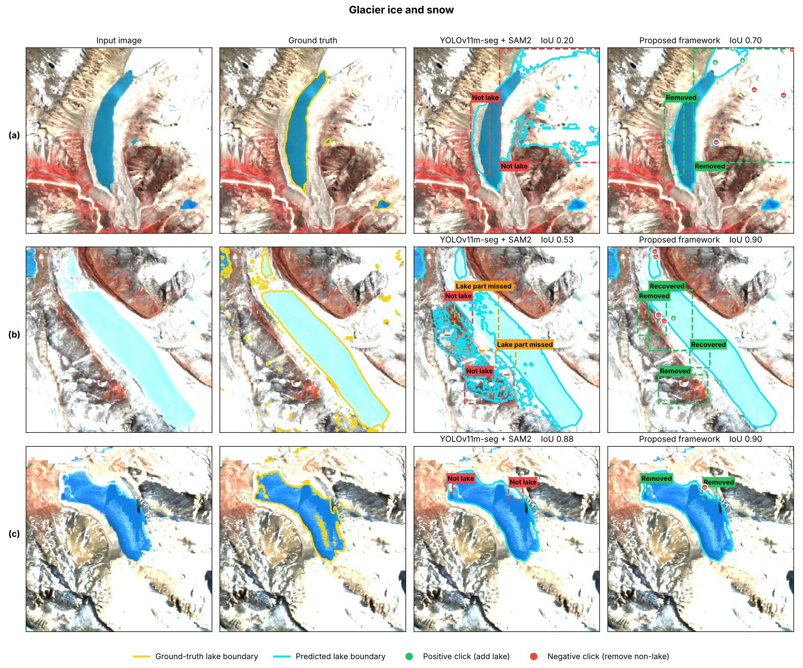
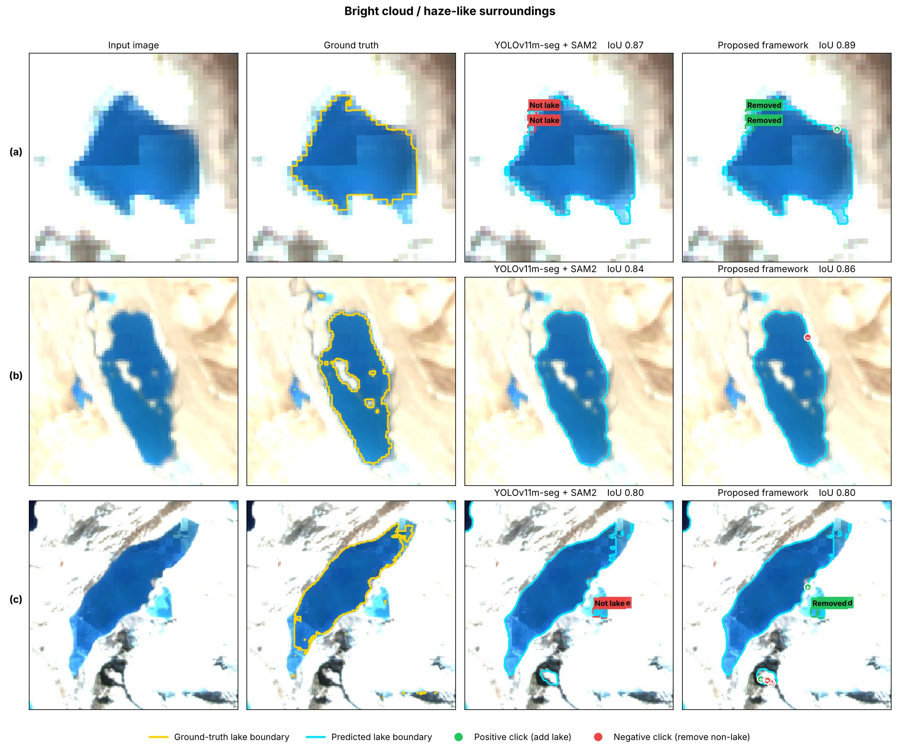
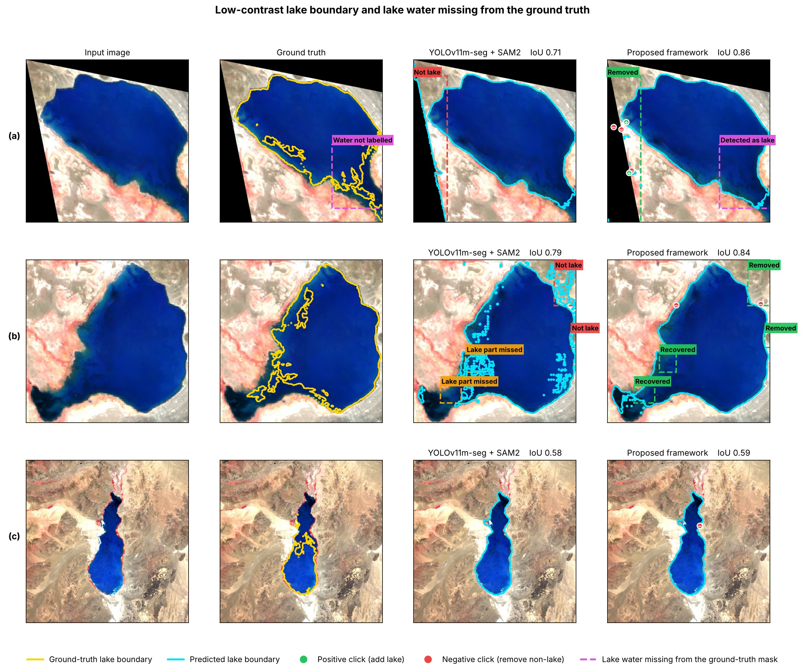
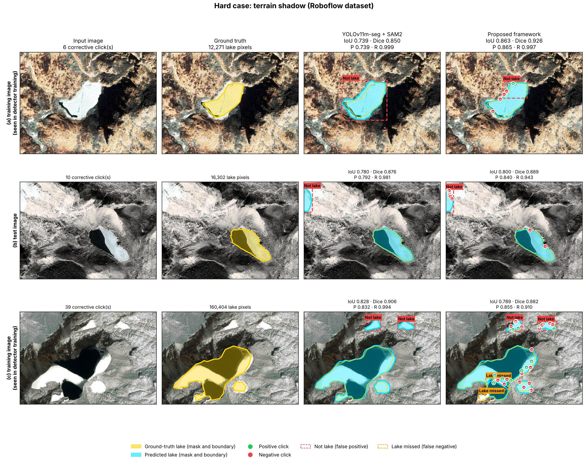
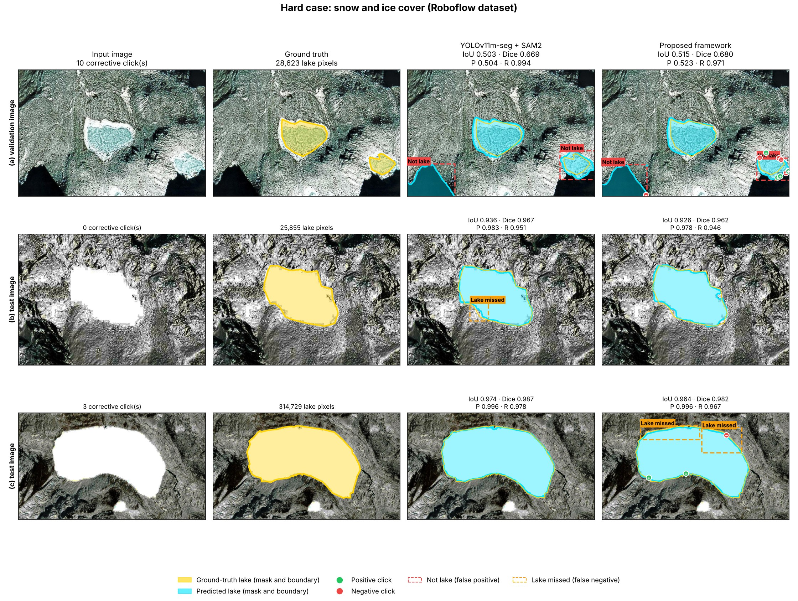
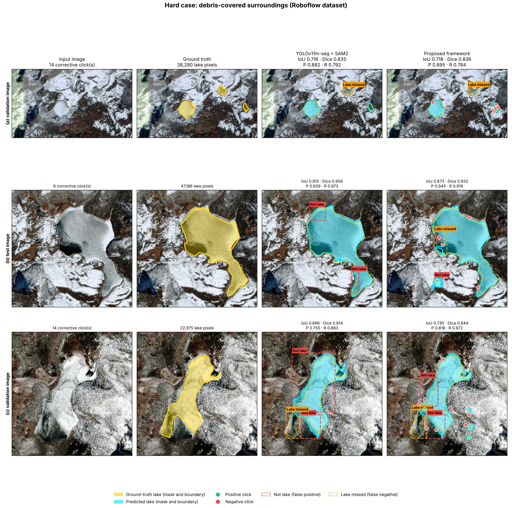
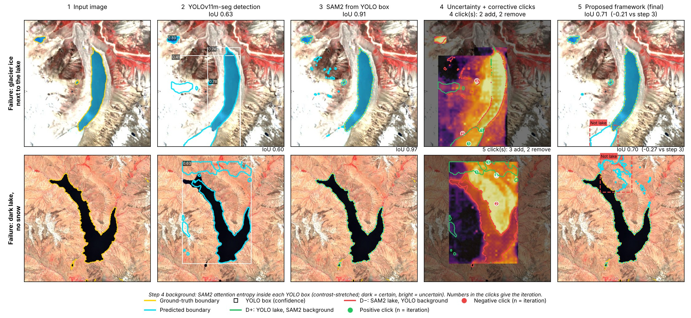

# Response to Reviewer ry7S

**ICVGIP 2026 — Submission 485**
*Glacial Lake Segmentation using YOLOv11m-seg and SAM2 with Uncertainty-Guided Refinement*

[← Back to main README](../../README.md) · Other reviewers: [FjD2](../FjD2/README.md) · [7hF5](../7hF5/README.md)

We thank the reviewer for the positive assessment. This page is a self-contained response: tables and figures are numbered locally (the number used in the submitted rebuttal text is shown beside each heading). It collects every table and figure cited in our response to Reviewer ry7S.

| Point | Topic | Evidence on this page |
|---|---|---|
| R1 | Challenging cases | Table 1, Table 2, Figs. 2–8 |
| R2 | Reproducibility | Implementation settings, Table 3, Table 4 |

---

## R1 — Challenging cases

We provide additional cases covering snow/ice, cloud/haze-like surroundings, low-contrast boundaries, terrain shadow and debris, plus failure examples.

### Table 1: Results for each Roboflow hard-case image (rebuttal Table 9)

| Case | Split | YOLOv11m-seg + SAM2 IoU | YOLOv11m-seg + SAM2 Dice | Proposed IoU | Proposed Dice | Proposed Precision | Proposed Recall | Clicks |
|---|---|---|---|---|---|---|---|---|
| Terrain shadow (Fig. 5a) | training | 0.739 | 0.850 | 0.863 | 0.926 | 0.865 | 0.997 | 6 |
| Terrain shadow (Fig. 5b) | test | 0.780 | 0.876 | 0.800 | 0.889 | 0.840 | 0.943 | 10 |
| Terrain shadow (Fig. 5c) | training | 0.828 | 0.906 | 0.789 | 0.882 | 0.855 | 0.910 | 39 |
| Snow and ice (Fig. 6a) | validation | 0.503 | 0.669 | 0.515 | 0.680 | 0.523 | 0.971 | 10 |
| Snow and ice (Fig. 6b) | test | 0.936 | 0.967 | 0.926 | 0.962 | 0.978 | 0.946 | 0 |
| Snow and ice (Fig. 6c) | test | 0.974 | 0.987 | 0.964 | 0.982 | 0.996 | 0.967 | 3 |
| Debris (Fig. 7a) | validation | 0.716 | 0.835 | 0.718 | 0.836 | 0.895 | 0.784 | 14 |
| Debris (Fig. 7b) | test | 0.915 | 0.956 | 0.873 | 0.932 | 0.945 | 0.919 | 6 |
| Debris (Fig. 7c) | validation | 0.686 | 0.814 | 0.730 | 0.844 | 0.818 | 0.872 | 14 |
| **Mean (9 images)** | | **0.786** | **0.873** | **0.797** | **0.881** | **0.857** | **0.923** | **11.3** |

> **Note.** These nine images include training, validation and test samples. They illustrate behaviour on difficult cases and are **not** presented as independent generalisation evidence.

### Table 2: IoU and Dice under challenging conditions (rebuttal Table 6)

| Condition | Images | IoU (YOLOv11m-seg + SAM2) | Dice (YOLOv11m-seg + SAM2) | IoU (Proposed) | Dice (Proposed) |
|---|---|---|---|---|---|
| Small lakes | 137 | 0.5774 | 0.7321 | **0.7024** | **0.8283** |
| Medium lakes | 136 | 0.7263 | 0.8415 | **0.7618** | **0.8686** |
| Large lakes | 137 | 0.7653 | 0.8670 | **0.8237** | **0.9062** |
| Regular boundary | 137 | 0.8869 | 0.9401 | **0.9126** | **0.9580** |
| Irregular boundary | 136 | 0.7396 | 0.8503 | **0.7864** | **0.8838** |
| Highly irregular boundary | 137 | 0.4837 | 0.6520 | **0.6218** | **0.7696** |
| Single lake | 60 | **0.9559** | **0.9775** | 0.9452 | 0.9753 |
| Multiple lakes | 350 | 0.6794 | 0.8091 | **0.7425** | **0.8554** |
| Snow, ice or cloud surroundings | 280 | 0.7674 | 0.8684 | **0.8014** | **0.8928** |
| Low-contrast boundary | 137 | 0.6836 | 0.8121 | **0.6967** | **0.8251** |
| Clear water | 78 | 0.5859 | 0.7389 | **0.8691** | **0.9334** |

### Figures

**Fig. 1: Step-by-step correction under challenging conditions** (input → YOLO → SAM2 from box → attention-entropy uncertainty + corrective clicks → final)

**Fig. 2: Glacier ice and snow, Kaggle test images**

**Fig. 3: Bright cloud- or haze-like surroundings, Kaggle test images**

**Fig. 4: Low-contrast lake edges and lake water missing from the ground truth, Kaggle test images**

**Fig. 5: Terrain shadow, Roboflow images** (rows a–c correspond to Table 1)

**Fig. 6: Snow and ice cover, Roboflow images** (rows a–c correspond to Table 1)

**Fig. 7: Debris-covered surroundings, Roboflow images** (rows a–c correspond to Table 1)

**Fig. 8: Cases where the correction fails**

---

## R2 — Reproducibility

### Implementation settings

| Component | Setting |
|---|---|
| Detector | YOLOv11m-seg, single class `lake` |
| Detector training | 120 epochs, image size 640, batch size 4, AdamW optimiser |
| Detector inference | image size 640, confidence threshold 0.25, NMS IoU 0.45, max 100 detections |
| Segmenter | SAM2 Hiera-B+ (checkpoint `sam2_hiera_base_plus.pt`, config `sam2_hiera_b+.yaml`), frozen, no fine-tuning |
| Initial prompts | One box per YOLO detection. Boundary-aware variant: box expanded by 6%, one positive point at the YOLO-mask centroid, up to 4 negative points just outside the mask extent (6% margin; left, right, top, bottom) |
| Candidate error regions | D+ = YOLO lake ∧ SAM2 background (→ positive click); D− = SAM2 lake ∧ YOLO background (→ negative click) |
| Ranking of regions | SAM2 attention entropy inside each YOLO box |
| Clicks per iteration | One click, at the point of highest attention entropy in the disagreement regions; regions smaller than 16 px or 0.2% of the box are ignored |
| Stopping rule | IoU ≥ 0.95 between consecutive masks (stability only), max 5 iterations |
| Morphology | 3×3 opening on disagreement regions; 3×3 opening and closing on the final mask |
| Evaluation | IoU, Dice/F1, Precision, Recall on the Kaggle Sentinel-2 test set (1,640 images) |
| Hardware | NVIDIA T4 GPU |

### Table 3: Dataset distribution (rebuttal Table 1)

| Dataset | Source | Images | Ground truth |
|---|---|---|---|
| Training | Roboflow glacial-lake datasets (training split) | 333 | 333 |
| Validation | Roboflow glacial-lake datasets (validation split) | 464 | 464 |
| Test | Kaggle Glacial Lake Dataset (Sentinel-2, 10 m, Himalaya) | 1640 | 1640 |
| **Total** | All datasets combined | **2437** | **2437** |

### Table 4: Computational cost on an NVIDIA T4 GPU (rebuttal Table 7)

| Component | Value |
|---|---|
| YOLOv11m-seg | 59.3 ms (123.3 GFLOPs) |
| SAM2 image encoder (once per image) | 309.6 ms (646.8 GFLOPs) |
| SAM2 mask decoder (per iteration) | 19.7 ms (3.66 GFLOPs) |
| Average corrective clicks per image | 0.91 |
| YOLOv11m-seg + SAM2 (total) | 408.9 ms per image |
| **Proposed framework (total)** | **420.8 ms per image (2.38 images/s), 774.6 GFLOPs** |
| Peak GPU memory | 1.37 GB |
| Parameters | 103.2M (no additional parameters) |

---

## Changes to the main paper

| Item | Where it goes in the revised paper |
|---|---|
| Implementation settings (above) | Experimental setup / implementation details section |
| Table 3 (dataset distribution) | Dataset section |
| Table 2 (challenging conditions) + Figs. 2–4, 8 | Results — qualitative and condition-wise analysis; failure cases in Limitations |
| Table 1, Figs. 5–7 | Supplementary material (contains training/validation images) |
